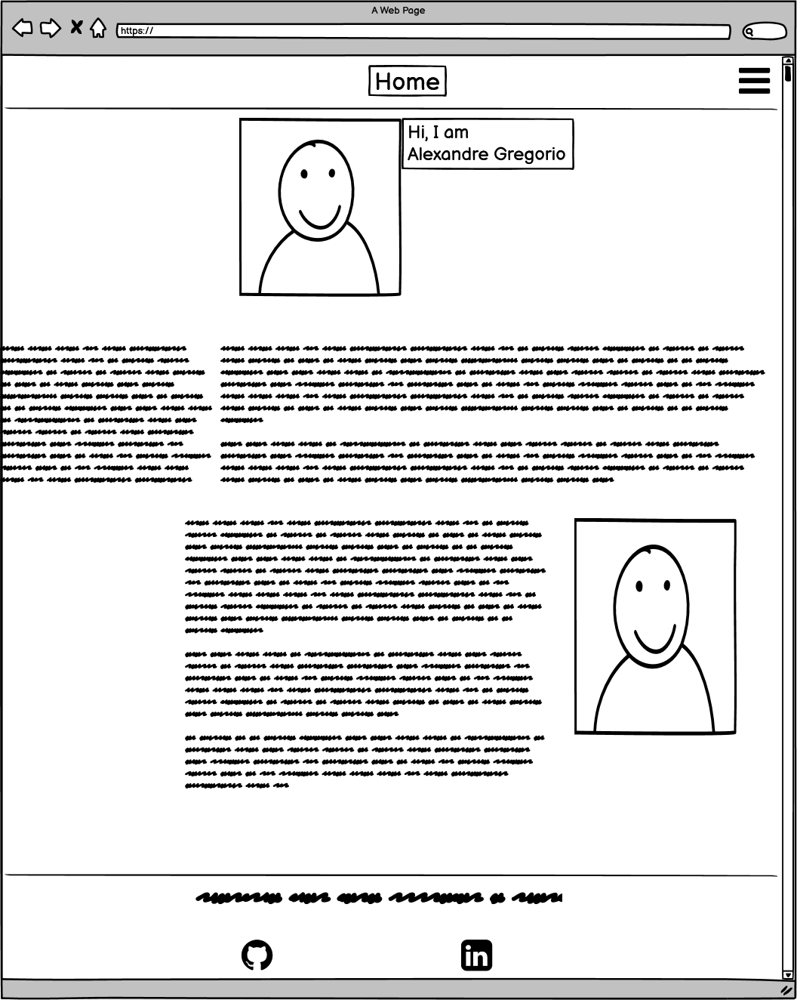
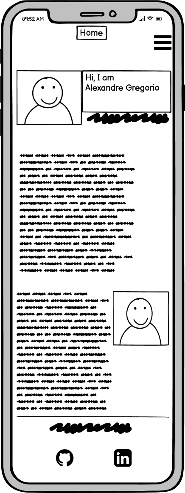
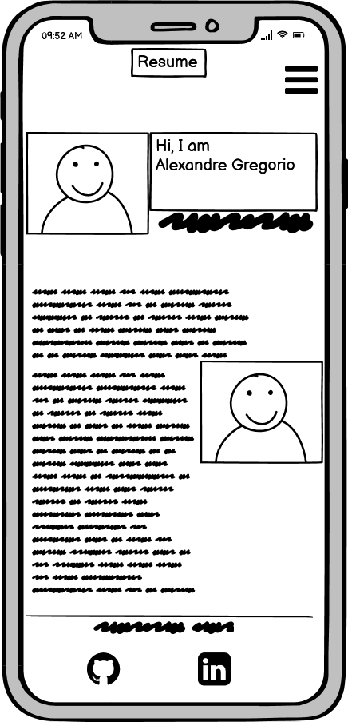

# MILESTONE PROJECT - 1 
  
Personal Portfolio Alexandre Gregorio,

This portfolio aims to offer for potencial recruiters an on-line presentation of myself covering my work history, graduation, and my skills as a Web Developer.

## UX DESIGN / PRESENTATION

## HOME 

The home page consists of a profile picture, greetings, and a dedicated section to describe "Who I am".
A hamburger button is applied on the top-right of the page, and it is programmed to collapse the navigation buttons. 
Inside the footer section, there is a link with a printable version of my CV and my contact details.

The method applied to develop this page is described as per below:  

#### Header
- Section wrapped with a profile image and greetings;
- Zoom animation applied on a scale from 0.9 to 1.0 to call the user's attention;
- Hamburger button developed with a transform translateX (0) animation and collapsing the navigation buttons. Once the user clicks on the hamburger button, the navigation shows up, and the options are available to be clicked.  

#### Resume 
- Screen developed to split its size into two different layouts;
- Personal details takes 1/3 of the desktop view, while "about me" takes 2/3 of the desktop view. 
- Screens are responsive, when the page is opened on a small screen, the layout will float to the left, and text is aligned to the center page. The paragraphs are developed to display its context underneath each other as a column.

#### About Me
- Dedicated section to demonstrate to potencial recruiters about the candidate personality, what he/she has done, and what are their expections;
- A picture, and a resume text with "Who I am" context were wrapped in the same section.

#### Footer 
- An anchor link to access a printable version of the CV is available in pdf;
- The target_ blank attribute is applied to keep the user on the main screen;
- Anchor links are applied to the professional network;
- Font awesome button is applied and it is hovering in red color.

## RESUME

The resume page consists of my work history and my skills as a developer student at Code Institute. 
Although my work history is from my background experiences, my front end and back end skills are copied from my resume project lecture at Code Institute.

The method applied to develop this page is described as per below:  

#### About Me
- Screen developed to split its size into two different layouts;
- Work history takes 1/3 of the desktop view, while "my skills" takes 2/3 of the desktop view. 
- Screens are responsive, when the page is opened on a small screen, the layout will float to the left, and text is aligned to the center page. The paragraphs are developed to display its context underneath each other as a column.

## CONTACT

The contact page consists of a form for potential recruiters to be in touch to send assessment tests, projects, and any other text inputs.

The method applied to develop this page is described as per below:  

#### Form
- Name, e-mail, and project description inputs;
- Required attribute;
- Placeholder fields;
- Submission button; 
- Boostrap effects.

## DOWNLOAD CV

Located on the footer section, the anchor link gives an option for recruiters to download the CV in pdf version. 

To keep the user on the main page, a "target_blank" attribute is applied to open the download page in a new tab.

### WIREFRAMES

The pages are developed and designed on their content at the structural level having commonly used layouts content and functionality which takes into account user needs and user journeys.

I have thought early in the project, in the development process to establish the basic structure of a page before visual design and content is added.

### Mobile Wireframes

The layout placement and how they interact with one another goes through many stages, from conception to mockups to finalized UI is based on a responsive view.

### HOME

### RESUME

### CONTACT

## TYPOGRAPHY

I have operated with mostly darker in the background and lighter colors for the font-family. 

The most dominant colors are: 
- Black for the background;
- White and cyan for the font-family.

Google Fonts CDN is applied, Sans-Serif and Exo are the main attributes for font-family and body text.

## APPLYIED TECHNOLOGIES

* HTML
* CSS3
* Javascript
* GitHub
* GitPod
* Bootstrap CDN https://getbootstrap.com/
* Bootstrap
* Fontawsome 

## VERSION CONTROL

I was using Git for version control, uploading the project to GitHub.

My GitHub repository for this project:
https://github.com/AlexandreGrego1/FinalVersion20-10-20

## TESTING WRITE-UP

Responsivity for mobile devices tested on :

* Google Chrome Developer Tools

* Microsoft Edge

* Opera Browser

* Mozilla Firefox

## BARRIES TO TECHNOLOGY DEVELOPMENT

As my lack of knowledge in development tools, I have developed my portfolio in the same stands according to my resume project lecture. 

Although my limited knowledge was a barrier, I have applied to this project the characteristics that in my opinion are similar to my profile. 

After developed my first project, I noticed that is required to spend more time on the theory lectures to have more understanding of the subjects to facilitate the development 
process in future projects. 

## CONCLUSION

This first project is crucial to keep me motivated to go throughout for the next modules on my course. 

As  I have got no idea what coding was before starting to study at Code Institute, I had several issues to develop this project and spending too much time sorting small problems
for being completely inexperienced. I have realized that I have to improve the way I was studying for the next modules.

Now I understand what our tutor Brian O Grady mean when he said "It is not a sprint, it is a marathon"

## REFERENCES

Scrimba - https://scrimba.com - Idea for portfolio  
Google Fonts - https://fonts.google.com - CDN for fonts used in the project  
Font Awesome - https://fontawesome.com - CDN for fonts used in the project  
W3schools - https://www.w3schools.com - CDN for fonts used in the project  
